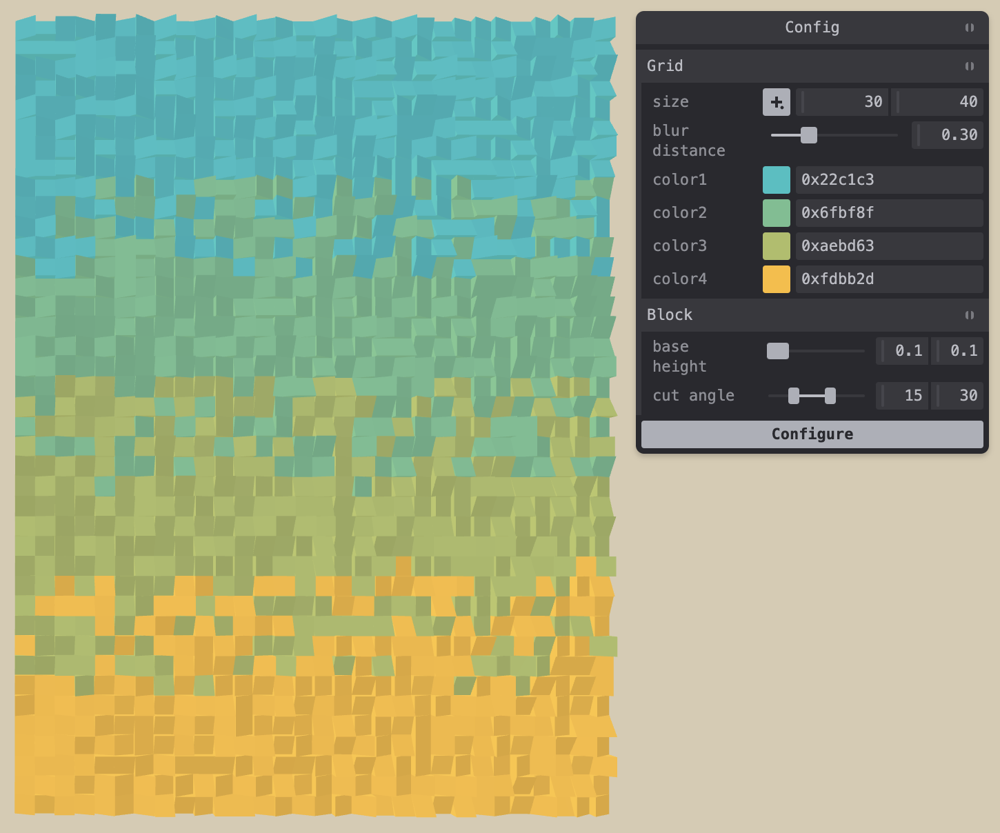
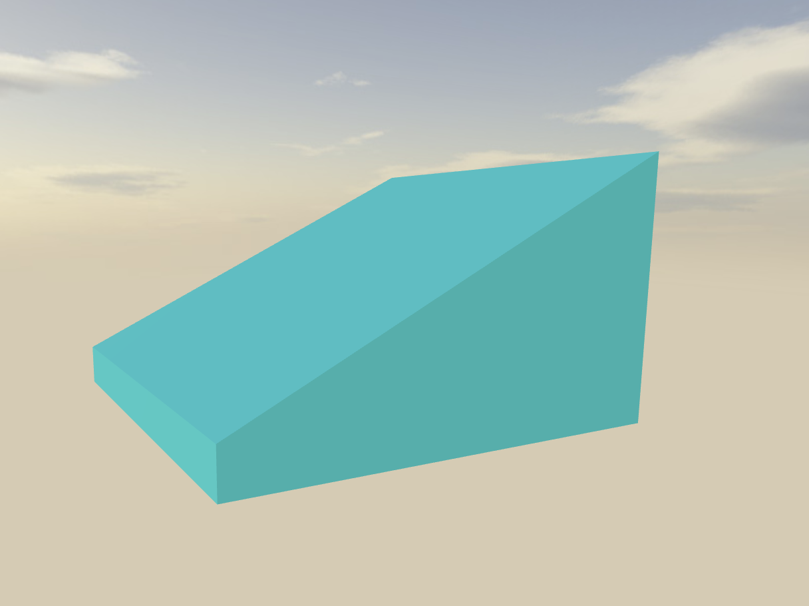

# Angular Art Configurator

Configures a grid of blocks with varied cut angles, rotations, colours, and heights



Close up of a block



## How to run

```
npm install
npm start
```

Open http://localhost:8080
